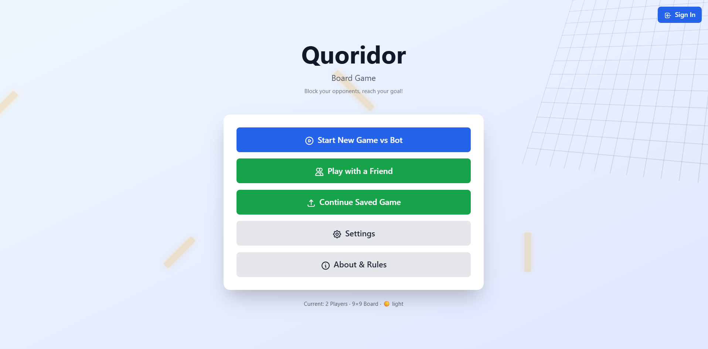
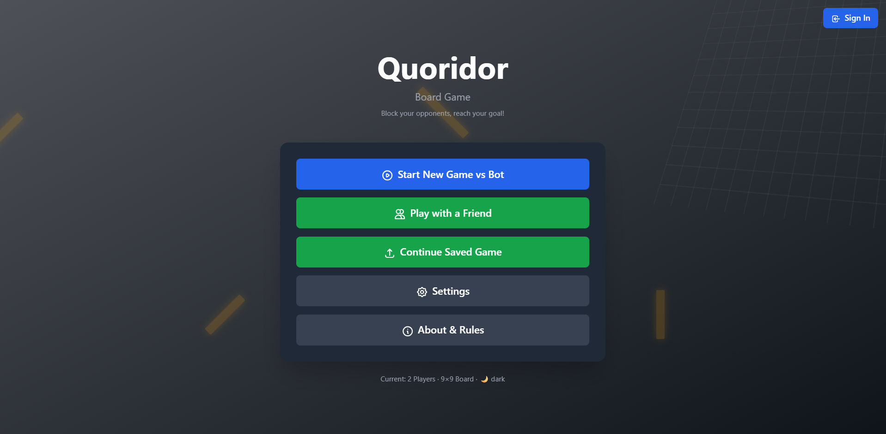
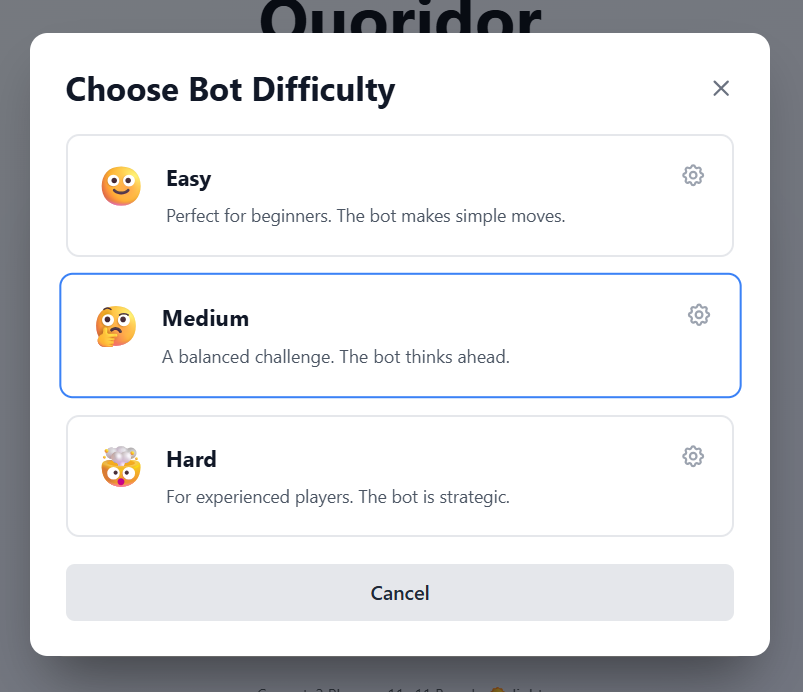
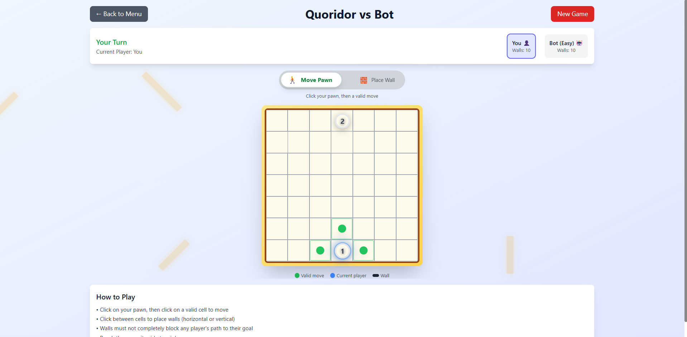
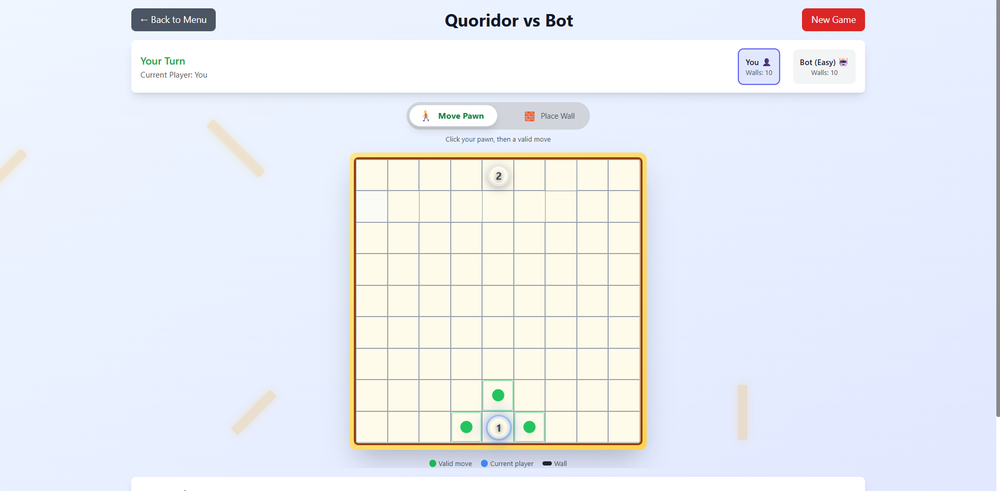
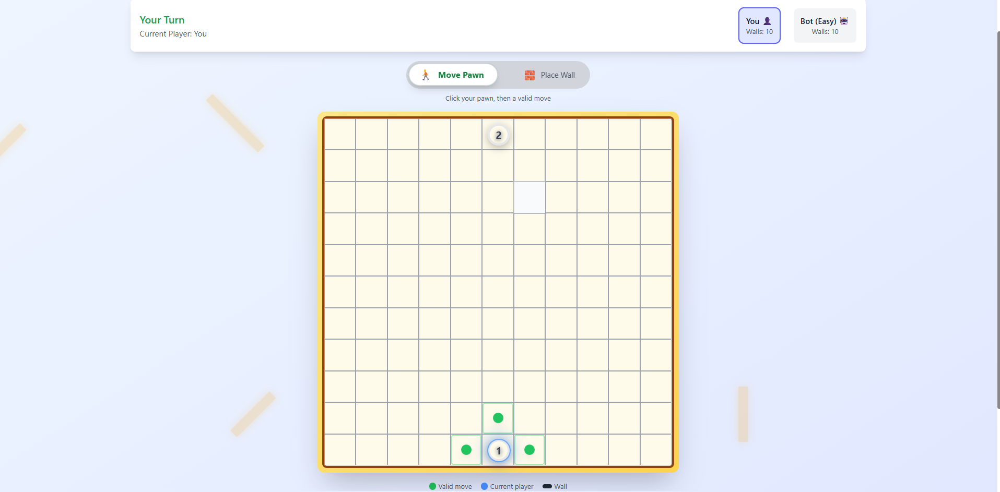
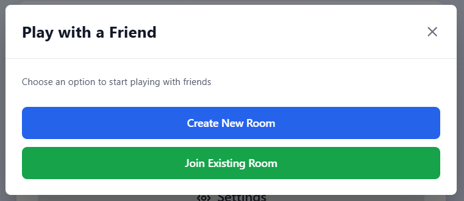
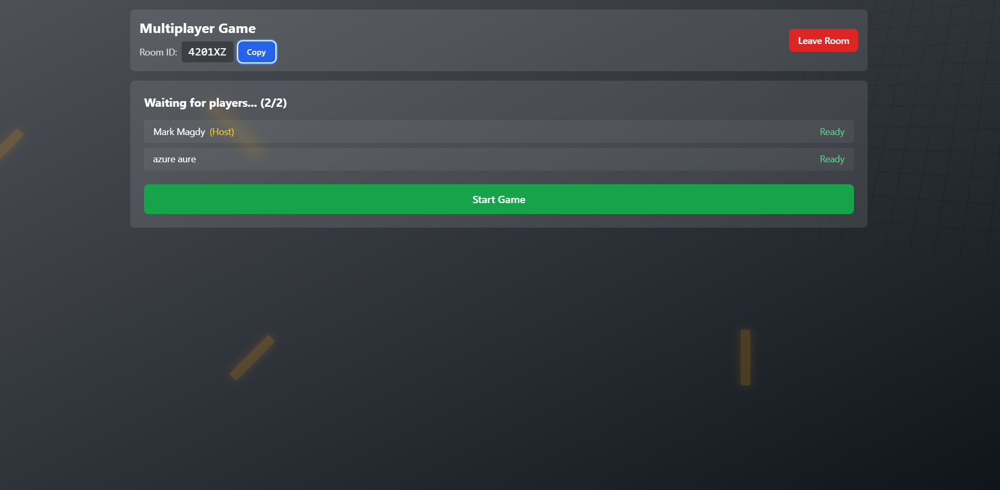
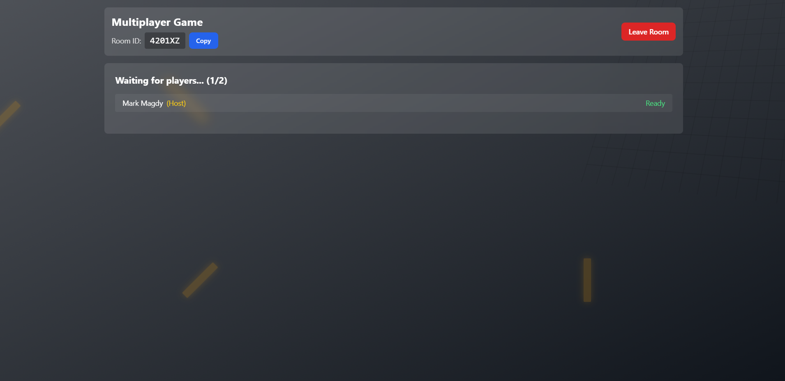

# Quoridor Game

A complete implementation of the classic abstract strategy board game Quoridor, featuring a modern web-based interface, AI opponents, and real-time multiplayer capabilities.

## 🎮 Play Now!

**🌐 [Play the Game Online](https://quoridorfrontend.proudrock-dd67c3c3.uaenorth.azurecontainerapps.io)**

**📺 [Watch Demo Video](https://drive.google.com/drive/folders/1MZMUDZxkqio-n5nysYGA0VAZXGWi4qfu)**

**💻 [GitHub Repository](https://github.com/mark-magdy/theQuoridorGame)**

### Game Overview

- **Players**: 2-4 players (this implementation supports 2 players)
- **Board**: 9×9 grid
- **Objective**: Be the first player to reach the opposite side of the board
- **Game Pieces**: 
  - Each player has one pawn
  - Each player has 10 walls

### Game Rules

1. **Setup**: Each player's pawn starts at the center of their respective baseline
2. **Turn Actions**: On each turn, a player must either:
   - Move their pawn one square orthogonally (up, down, left, or right)
   - Place a wall to block opponent movement

3. **Pawn Movement**:
   - Move one square in any orthogonal direction
   - Cannot move through walls or other pawns
   - Can jump over an adjacent opponent's pawn
   - Can move diagonally when a jump is blocked by a wall

4. **Wall Placement**:
   - Walls are 2 squares long
   - Placed on edges between squares
   - Cannot overlap or cross existing walls
   - Must always leave at least one valid path for each player to reach their goal
   - Once placed, walls are permanent

5. **Winning**: First player to move their pawn to any square on the opposite side wins

## 📸 Screenshots

### Landing Pages
<p align="center">
  
  
</p>
<p align="center">
  <em>Landing page in light and dark theme modes</em>
</p>

### Bot Difficulty Selection
<p align="center">
  
</p>
<p align="center">
  <em>Choose AI difficulty level before starting the game</em>
</p>

### Game vs Bot - Different Board Sizes
<p align="center">
  
  
  
</p>
<p align="center">
  <em>Playing against AI on 7×7, 9×9, and 11×11 boards</em>
</p>

### Multiplayer Modes
<p align="center">
  
  
</p>
<p align="center">
  <em>Local multiplayer and online room lobby</em>
</p>

### Waiting for Opponent
<p align="center">
  
</p>
<p align="center">
  <em>Waiting in the lobby for another player to join</em>
</p>

## 🚀 Installation and Running Instructions

### Prerequisites

- **Docker** and **Docker Compose** (recommended for easiest setup)
- OR individual installations:
  - Node.js 18+ and npm
  - .NET 8.0 SDK
  - PostgreSQL 16+
  - Redis 7+

### Option 1: Docker Compose (Recommended)

1. **Clone the repository**:
   ```bash
   git clone https://github.com/mark-magdy/theQuoridorGame.git
   cd theQuoridorGame
   ```

2. **Start all services**:
   ```bash
   docker-compose up -d
   ```

3. **Access the application**:
   - Frontend: http://localhost:3000
   - Backend API: http://localhost:5299

4. **Stop the application**:
   ```bash
   docker-compose down
   ```

### Option 2: Manual Setup

#### Backend Setup

1. **Navigate to backend directory**:
   ```bash
   cd backend
   ```

2. **Configure database connection**:
   - Copy `quoridorBackend.Api/.env.example` to `.env`
   - Update connection strings if needed

3. **Restore dependencies**:
   ```bash
   dotnet restore
   ```

4. **Run database migrations**:
   ```bash
   cd quoridorBackend.Api
   dotnet ef database update
   ```

5. **Start the backend**:
   ```bash
   dotnet run
   ```

   Backend will run on: http://localhost:5299

#### Frontend Setup

1. **Navigate to frontend directory**:
   ```bash
   cd frontend
   ```

2. **Install dependencies**:
   ```bash
   npm install
   ```

3. **Configure environment**:
   - Copy `.env.local.example` to `.env.local`
   - Update `NEXT_PUBLIC_API_URL` if needed

4. **Start the development server**:
   ```bash
   npm run dev
   ```

   Frontend will run on: http://localhost:3000

5. **For production build**:
   ```bash
   npm run build
   npm start
   ```

### Database Services

- **PostgreSQL**: Port 5432 (default credentials in docker-compose.yaml)
- **Redis**: Port 6379

## 🎯 Controls Explanation

### Main Menu

- **Play vs Bot**: Start a single-player game against the AI
- **Multiplayer**: Create or join a multiplayer game
- **Profile**: View your game statistics and history

### In-Game Controls

#### Pawn Movement
- **Click on your pawn**: Highlights valid move positions
- **Click on highlighted square**: Moves pawn to that position
- **Valid moves include**:
  - Adjacent empty squares (up, down, left, right)
  - Jump over opponent's pawn
  - Diagonal moves around opponent when blocked

#### Wall Placement
1. **Click "Place Wall" button** or toggle wall placement mode
2. **Select orientation**: Choose horizontal or vertical
3. **Click on the board**: Position appears as a preview
4. **Click again to confirm**: Places the wall permanently
5. **Wall counter**: Shows remaining walls for each player

#### Game Controls
- **Reset/New Game**: Start a fresh game
- **Settings**: Adjust game preferences
- **Exit**: Return to main menu

<!-- ### Keyboard Shortcuts
- **Arrow Keys**: Navigate pawn (when selected)
- **W**: Toggle wall placement mode
- **H**: Switch to horizontal wall orientation
- **V**: Switch to vertical wall orientation
- **Esc**: Cancel current action/return to menu
- **Space**: Confirm action -->

### AI Game Controls
- **Difficulty Selection**: Choose Easy, Medium, or Hard before starting
- **Bot Move Delay**: Configurable delay for AI moves (for better visualization)

### Multiplayer Controls
- **Create Room**: Generate a unique room code to share
- **Join Room**: Enter room code to join a game
- **Chat** (if enabled): Communicate with opponent
- **Leave Game**: Exit the current match

## 🤖 AI Implementation

The game features three difficulty levels:

- **Easy**: Random valid moves with basic wall placement
- **Medium**: Minimax algorithm with limited depth
- **Hard**: Advanced minimax with alpha-beta pruning and strategic evaluation

## 🏗️ Technology Stack

### Frontend
- **Next.js 14**: React framework with server-side rendering
- **TypeScript**: Type-safe development
- **Tailwind CSS**: Utility-first styling
- **Framer Motion**: Smooth animations
- **SignalR**: Real-time multiplayer communication

### Backend
- **.NET 8.0**: Modern C# API
- **Entity Framework Core**: Database ORM
- **SignalR**: WebSocket communication
- **PostgreSQL**: Primary database
- **Redis**: Caching and session management

### Infrastructure
- **Docker**: Containerization
- **Docker Compose**: Multi-container orchestration

## 📁 Project Structure

```
quoridor-game/
├── backend/                    # .NET Backend API
│   ├── quoridorBackend.Api/   # API Controllers & SignalR Hubs
│   ├── quoridorBackend.BLL/   # Business Logic Layer
│   ├── quoridorBackend.DAL/   # Data Access Layer
│   └── quoridorBackend.Domain/# Domain Models & DTOs
├── frontend/                   # Next.js Frontend
│   └── src/
│       ├── app/               # Next.js pages
│       ├── components/        # React components
│       ├── features/          # Feature modules
│       └── lib/               # Utilities
├── docker-compose.yaml        # Docker orchestration
└── README.md                  # This file
```

## 🎥 Demo Video

Watch the complete game demonstration and feature walkthrough:

**[📺 Quoridor Game Demo Video](https://drive.google.com/drive/folders/1MZMUDZxkqio-n5nysYGA0VAZXGWi4qfu)**

The demo includes:
- Game setup and UI overview
- Human vs Human gameplay demonstration
- Human vs AI gameplay at different difficulty levels
- Multiplayer features
- Strategy explanations

## 🌟 Features

### Core Features
- ✅ Complete Quoridor ruleset implementation
- ✅ Intuitive graphical user interface
- ✅ Human vs Human mode
- ✅ Human vs AI with multiple difficulty levels
- ✅ Valid move highlighting
- ✅ Path validation (ensures walls don't completely block players)
- ✅ Real-time multiplayer support

### Bonus Features
- ✅ AI difficulty levels (Easy, Medium, Hard)
- ✅ Game state saving/loading
- ✅ Real-time multiplayer with room system
- ✅ User authentication and profiles
- ✅ Game history and statistics
- ✅ Responsive design for different screen sizes

## 🧪 Testing

### Backend Tests
```bash
cd backend
dotnet test
```

### Frontend Tests
```bash
cd frontend
npm test
```

### Game API Testing
Use the provided Postman collection:
- Import `GameTestAPI.postman_collection.json`
- Or use the PowerShell test script: `./test-game-api.ps1`

## 🔧 Configuration

### Backend Configuration
Edit `backend/quoridorBackend.Api/appsettings.json`:
- Database connection strings
- JWT authentication settings
- Redis configuration
- Google OAuth settings

### Frontend Configuration
Edit `frontend/.env.local`:
- API endpoint URL
- Google OAuth client ID
- Environment variables

## 🐛 Troubleshooting

### Common Issues

**Port already in use**:
```bash
# Check what's using the port
netstat -ano | findstr :3000
# Kill the process or use different ports
```

**Database connection failed**:
- Ensure PostgreSQL is running
- Check connection string in appsettings.json
- Verify database exists: `dotnet ef database update`

**Frontend can't connect to backend**:
- Verify backend is running on port 5299
- Check NEXT_PUBLIC_API_URL in .env.local
- Check CORS settings in backend

**Redis connection issues**:
- Ensure Redis is running
- Check Redis connection string
- Verify port 6379 is available

## 📝 Development

### Adding New Features
1. Create feature branch: `git checkout -b feature/your-feature`
2. Make changes
3. Test thoroughly
4. Submit pull request

### Code Style
- Backend: Follow C# conventions and .NET best practices
- Frontend: Follow TypeScript and React best practices
- Use ESLint and Prettier for frontend code formatting

## 📄 License

This project was developed as part of CSE472s: Artificial Intelligence Course, Fall 2025.

**Note**: This is an academic project developed for educational purposes.
